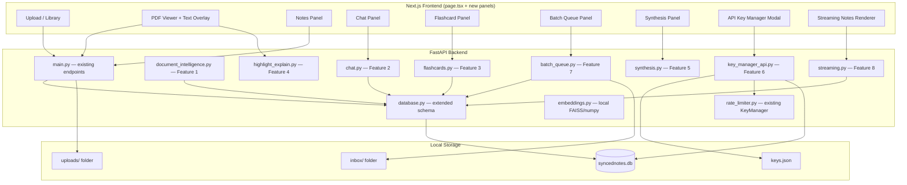
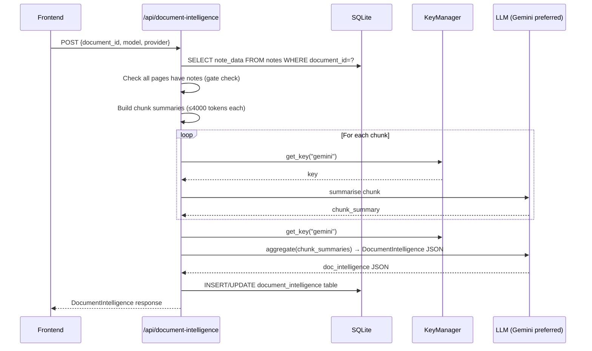
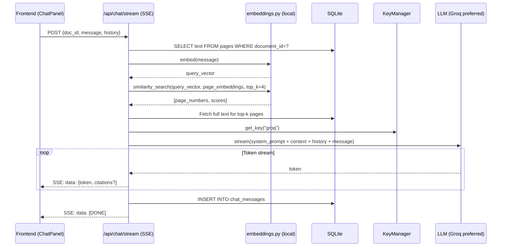
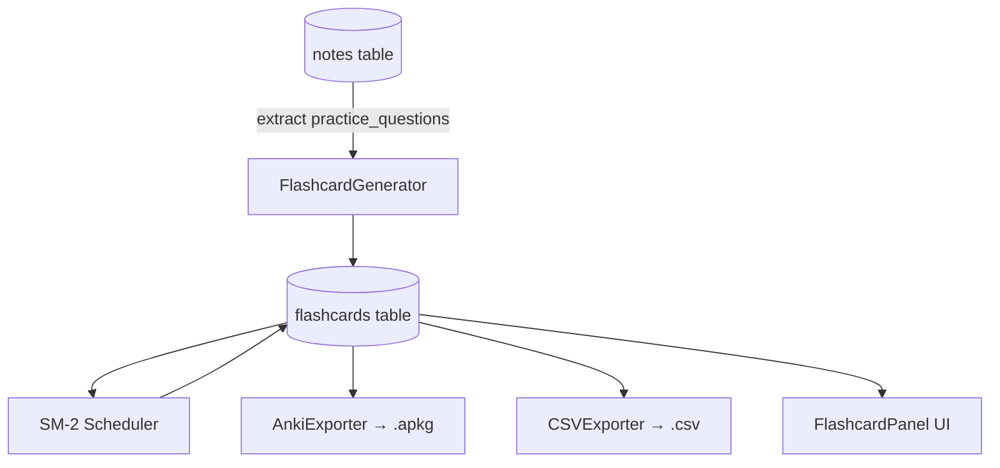
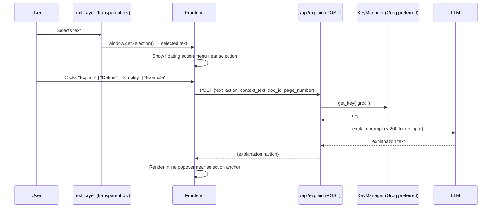
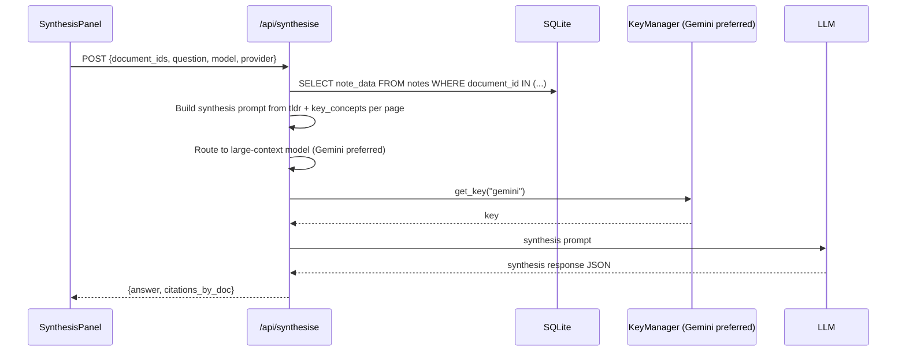
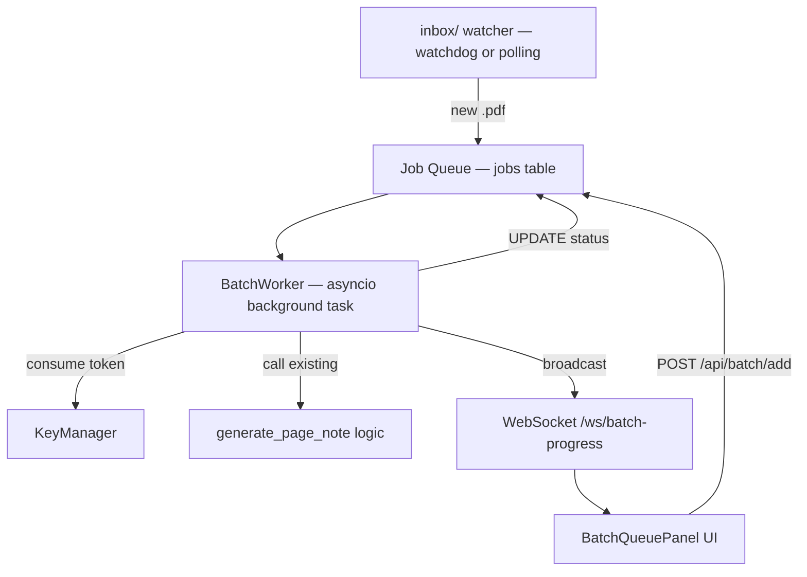
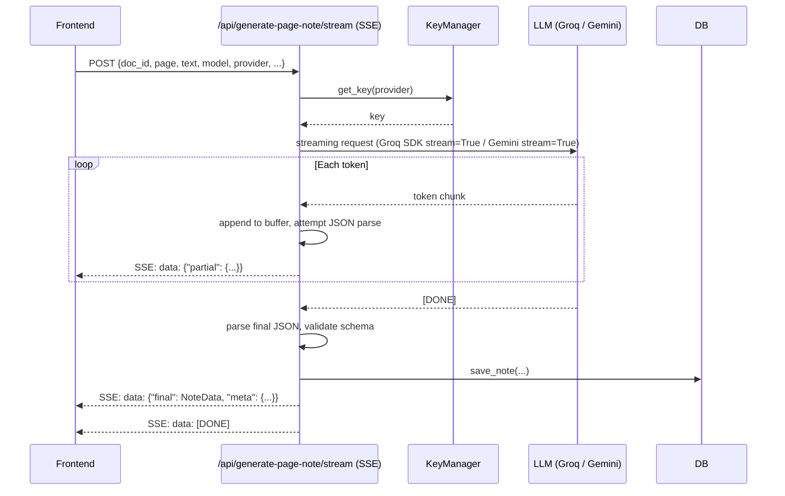

# Design Document: SyncedNotes AI — Features Roadmap

## Overview

This document is the comprehensive technical design for eight major feature groups that extend SyncedNotes AI from a per-page study assistant into a full document intelligence platform. The features build on the existing FastAPI + SQLite backend and Next.js frontend, reusing the established token-bucket rate limiter, cross-provider fallback chain, and SQLite schema wherever possible.

The design is grounded in three constraints that run through every feature:

1. **Rate-limit awareness** — Gemini 5 RPM × N keys, Groq 30 RPM × N keys, Mistral 2 RPM × N keys. Every feature must schedule API calls so the existing `KeyManager` can serve them without starvation.
2. **Local-first** — all state lives in the local SQLite database (`syncednotes.db`). No cloud database, no external auth.
3. **Additive schema** — new tables are added to `database.py`; existing tables (`documents`, `pages`, `notes`) are never structurally altered.

---

## Architecture



---

## Components and Interfaces

The system is decomposed into eight backend modules (one per feature) that plug into the existing FastAPI app, plus a set of new frontend panel components. Each module owns its endpoints, its prompt logic, and its database helpers.

### Backend Modules

| Module | Owns |
|---|---|
| `document_intelligence.py` | `/api/document-intelligence` endpoints, map-reduce pipeline |
| `chat.py` | `/api/chat/session`, `/api/chat/stream`, `/api/chat/history` endpoints |
| `embeddings.py` | `compute_embedding()`, `cosine_similarity()`, `find_top_k_pages()`, `ensure_page_embeddings()` |
| `flashcards.py` | `/api/flashcards/*` endpoints, SM-2 logic, Anki export |
| `highlight_explain.py` | `/api/explain` endpoint, prompt templates |
| `synthesis.py` | `/api/synthesise` endpoint, prompt builder |
| `key_manager_api.py` | `/api/keys/*` endpoints, `keys.json` I/O, `mask_key()`, `probe_key()` |
| `batch_queue.py` | `/api/batch/*` endpoints, `BatchWorker`, `InboxWatcher`, `/ws/batch-progress` |
| `streaming.py` | `/api/generate-page-note/stream` SSE endpoint, per-provider streaming adapters |

### Frontend Components

| Component | Panel location |
|---|---|
| `DocumentIntelligencePanel` | Right pane, triggers after all pages complete |
| `ChatPanel` | Slide-in from right, per-document |
| `TextLayer` + `ExplainMenu` + `ExplainPopover` | Overlay on each page image |
| `FlashcardPanel` | Modal/drawer from toolbar |
| `SynthesisPanel` | Modal from document library toolbar |
| `KeyManagerModal` | Settings modal from gear icon |
| `BatchQueuePanel` | Drawer from toolbar |
| `StreamingNoteRenderer` | Extends existing note panel |

---

## Data Models

See the **Schema Changes** subsections under each feature for the full SQL DDL. The complete list of new tables added to `database.py`:

```sql
-- Feature 1
CREATE TABLE IF NOT EXISTS document_intelligence (
    id INTEGER PRIMARY KEY AUTOINCREMENT,
    document_id INTEGER NOT NULL UNIQUE,
    executive_summary TEXT NOT NULL,
    concept_index TEXT NOT NULL,        -- JSON array
    chapter_groups TEXT NOT NULL,       -- JSON array
    difficulty_score INTEGER NOT NULL,
    prerequisite_knowledge TEXT NOT NULL, -- JSON array
    model TEXT NOT NULL,
    provider TEXT NOT NULL,
    created_at TIMESTAMP DEFAULT CURRENT_TIMESTAMP,
    FOREIGN KEY (document_id) REFERENCES documents(id) ON DELETE CASCADE
);

-- Feature 2
CREATE TABLE IF NOT EXISTS page_embeddings (
    id INTEGER PRIMARY KEY AUTOINCREMENT,
    document_id INTEGER NOT NULL,
    page_number INTEGER NOT NULL,
    embedding TEXT NOT NULL,   -- JSON float array
    model TEXT NOT NULL,
    created_at TIMESTAMP DEFAULT CURRENT_TIMESTAMP,
    FOREIGN KEY (document_id) REFERENCES documents(id) ON DELETE CASCADE,
    UNIQUE(document_id, page_number, model)
);

CREATE TABLE IF NOT EXISTS chat_sessions (
    id INTEGER PRIMARY KEY AUTOINCREMENT,
    document_id INTEGER NOT NULL,
    created_at TIMESTAMP DEFAULT CURRENT_TIMESTAMP,
    FOREIGN KEY (document_id) REFERENCES documents(id) ON DELETE CASCADE
);

CREATE TABLE IF NOT EXISTS chat_messages (
    id INTEGER PRIMARY KEY AUTOINCREMENT,
    session_id INTEGER NOT NULL,
    role TEXT NOT NULL,
    content TEXT NOT NULL,
    cited_pages TEXT,          -- JSON array of ints
    created_at TIMESTAMP DEFAULT CURRENT_TIMESTAMP,
    FOREIGN KEY (session_id) REFERENCES chat_sessions(id) ON DELETE CASCADE
);

-- Feature 3
CREATE TABLE IF NOT EXISTS flashcards (
    id INTEGER PRIMARY KEY AUTOINCREMENT,
    document_id INTEGER NOT NULL,
    page_number INTEGER NOT NULL,
    front TEXT NOT NULL,
    back TEXT NOT NULL,
    difficulty TEXT NOT NULL,
    sm2_n INTEGER DEFAULT 0,
    sm2_easiness REAL DEFAULT 2.5,
    sm2_interval INTEGER DEFAULT 1,
    sm2_next_review TEXT DEFAULT (date('now')),
    created_at TIMESTAMP DEFAULT CURRENT_TIMESTAMP,
    FOREIGN KEY (document_id) REFERENCES documents(id) ON DELETE CASCADE
);

CREATE TABLE IF NOT EXISTS flashcard_collections (
    id INTEGER PRIMARY KEY AUTOINCREMENT,
    name TEXT NOT NULL,
    document_ids TEXT NOT NULL,
    created_at TIMESTAMP DEFAULT CURRENT_TIMESTAMP
);

-- Feature 7
CREATE TABLE IF NOT EXISTS batch_jobs (
    id INTEGER PRIMARY KEY AUTOINCREMENT,
    document_id INTEGER,
    filename TEXT NOT NULL,
    file_path TEXT NOT NULL,
    status TEXT NOT NULL DEFAULT 'queued',
    total_pages INTEGER DEFAULT 0,
    completed_pages INTEGER DEFAULT 0,
    error_message TEXT,
    model TEXT,
    provider TEXT,
    created_at TIMESTAMP DEFAULT CURRENT_TIMESTAMP,
    started_at TIMESTAMP,
    completed_at TIMESTAMP
);
```

---

## Error Handling

### Rate Limit Errors (all features)

When `key_manager.get_key(provider)` returns `None`:
- **Interactive endpoints** (explain, chat, synthesis): return HTTP 429 with `{"detail": "Rate limited. Retry in Xs"}` where X = `key_manager.seconds_until_available(provider)`.
- **Streaming endpoints**: emit `{"type": "error", "message": "Rate limited. Retry in Xs"}` SSE event and close the stream.
- **Batch worker**: sleep for `seconds_until_available()` and retry the same page without marking the job as failed.

### Incomplete Document Errors (features 1, 5)

`POST /api/document-intelligence` and `POST /api/synthesise` gate on all pages having notes. If the gate fails: HTTP 400 with `{"detail": "Pages missing notes: [N, M, ...]"}`.

### Stream Interruption (feature 8)

On SSE client disconnect: if buffer contains `title` + `summary`, save partial note. Otherwise discard. Log the interruption at INFO level.

### Anki Export Schema Errors (feature 3)

If the `.apkg` SQLite construction fails for any reason, return HTTP 500 with detail. The CSV fallback always succeeds as long as the flashcards table has rows.

### Probe Timeout (feature 6)

If a key probe exceeds 5 seconds, return `{"valid": false, "message": "Timeout after 5s", "latency_ms": 5000}`. Do not save the key.

---

## Testing Strategy

### Unit Testing Approach

Each backend module has a corresponding test file in `backend/tests/`. Tests use `pytest` with `unittest.mock` for LLM calls and database interactions. Key unit test coverage:

- `test_document_intelligence.py`: gate check logic, chunk boundary calculation, prompt builder.
- `test_chat.py`: prompt construction, citation extraction, session creation.
- `test_flashcards.py`: SM-2 state transitions for all quality values, Anki export structure, CSV column names.
- `test_highlight_explain.py`: prompt template selection, text truncation, token count estimation.
- `test_synthesis.py`: gate check, prompt token estimation, provider routing decision.
- `test_key_manager_api.py`: masking function, `keys.json` round-trip, bucket state preservation on rebuild.
- `test_batch_queue.py`: job state machine transitions, inter-page gap, WebSocket broadcast sequence.
- `test_streaming.py`: partial JSON extraction, field event ordering, disconnection handling.

### Property-Based Testing Approach

Property tests use `hypothesis` (Python) for backend modules. Each property listed in the Correctness Properties section has a corresponding `@given` test annotated with the property number.

**Property Test Library**: `hypothesis` (Python backend), `fast-check` (TypeScript frontend)

Property tests are tagged with `@pytest.mark.property` to allow separate CI runs.

### Integration Testing Approach

Integration tests mock the LLM provider layer (`call_gemini`, `call_groq`, `call_mistral`) but use a real in-memory SQLite database. They verify full request-response cycles for each endpoint. One integration test per feature group covers the happy path.

---

## Feature 1: Cross-Page Document Intelligence

### Overview

After all pages of a document are individually processed, a document-level pass generates an executive summary, a global concept index, chapter/section groupings, and a difficulty score. The challenge is that 30 pages of notes can exceed 60,000 tokens — more than most free-tier models can handle in one call — so the design uses a two-stage map-reduce approach.

### Architecture



### Two-Stage Map-Reduce Strategy

**Stage 1 — Chunk Summarisation (Map)**
Each page note already contains a `tldr` field (≈50 tokens) and `summary` (≈150 tokens). Instead of sending full `note_data` JSON, Stage 1 extracts only `tldr` + `key_concepts[].term` per page, producing ≈100 tokens per page. A 30-page document thus fits in ≈3,000 tokens — well within Groq's 8k context even in one shot.

If a document exceeds 60 pages, the pages are grouped into chunks of 20, each chunk is summarised independently, and the chunk summaries are then aggregated.

**Stage 2 — Aggregation (Reduce)**
The aggregated summaries, section headings, and concept terms are sent in a single call to produce the final `DocumentIntelligence` object.

**Model Routing**
- Prefer **Gemini** (1M context window) for aggregation if available.
- Fall back to **Groq** (llama-3.3-70b, 128k context) for chunked documents ≤ 30 pages.
- **Mistral** as last resort.

### Schema Changes

```sql
CREATE TABLE IF NOT EXISTS document_intelligence (
    id INTEGER PRIMARY KEY AUTOINCREMENT,
    document_id INTEGER NOT NULL UNIQUE,
    executive_summary TEXT NOT NULL,        -- 3-5 paragraph prose
    concept_index TEXT NOT NULL,            -- JSON: [{term, definition, pages:[]}]
    chapter_groups TEXT NOT NULL,           -- JSON: [{title, page_start, page_end, summary}]
    difficulty_score INTEGER NOT NULL,      -- 1-5
    prerequisite_knowledge TEXT NOT NULL,   -- JSON: [string]
    model TEXT NOT NULL,
    provider TEXT NOT NULL,
    created_at TIMESTAMP DEFAULT CURRENT_TIMESTAMP,
    FOREIGN KEY (document_id) REFERENCES documents(id) ON DELETE CASCADE
)
```

### API Contract

**POST `/api/document-intelligence`**
```typescript
// Request
{
  document_id: number;
  model: string;
  provider: string;
}

// Response
{
  document_id: number;
  executive_summary: string;
  concept_index: Array<{
    term: string;
    definition: string;
    pages: number[];
  }>;
  chapter_groups: Array<{
    title: string;
    page_start: number;
    page_end: number;
    summary: string;
  }>;
  difficulty_score: number;        // 1 = introductory, 5 = advanced
  prerequisite_knowledge: string[];
  model: string;
  provider: string;
  cached: boolean;
}
```

**GET `/api/document-intelligence/{doc_id}`**
Returns cached result or 404 if not yet generated.

### Rate Limit Strategy

The endpoint is gated: it refuses to run if any page note is missing. The entire operation is treated as a single "large call" reservation:
- Wait for `key_manager.seconds_until_available("gemini")` before starting Stage 2.
- Stage 1 chunk calls each go through the normal `KeyManager.get_key()` round-robin with a 2s gap between chunks.
- A 429 on any chunk suspends the whole job and retries after the bucket refills.

### Frontend Component Design

A new **Document Intelligence panel** appears in the right pane when all pages have been generated. It shows:
- A collapsible executive summary section.
- An interactive concept index (searchable, click to jump to page).
- Chapter grouping as a visual timeline/accordion.
- A difficulty badge (1–5 stars) and prerequisite chips.

Trigger: A "Generate Document Summary" button appears in the toolbar once `notes[every page].status === "success"`.

---

## Feature 2: Chat with Document

### Overview

A chat panel where users ask free-form questions grounded in the document's actual page text. Responses stream token-by-token via SSE and cite which pages they drew from. A retrieval-augmented generation (RAG) pipeline using local embeddings handles context window limits.

### Architecture



### Embedding Strategy

No external embedding API is required. The design uses **numpy cosine similarity** with a lightweight local embedding model:
- **Primary**: `sentence-transformers/all-MiniLM-L6-v2` via HuggingFace Inference API (free tier, no key needed for public models, ~384-dim vectors).
- **Fallback**: TF-IDF bag-of-words using Python's `sklearn` (always available, no network call). Lower quality but zero latency and zero API cost.

Page embeddings are computed once on first chat open and cached in a new `page_embeddings` table.

### Schema Changes

```sql
CREATE TABLE IF NOT EXISTS page_embeddings (
    id INTEGER PRIMARY KEY AUTOINCREMENT,
    document_id INTEGER NOT NULL,
    page_number INTEGER NOT NULL,
    embedding TEXT NOT NULL,   -- JSON array of floats
    model TEXT NOT NULL,       -- embedding model name
    created_at TIMESTAMP DEFAULT CURRENT_TIMESTAMP,
    FOREIGN KEY (document_id) REFERENCES documents(id) ON DELETE CASCADE,
    UNIQUE(document_id, page_number, model)
);

CREATE TABLE IF NOT EXISTS chat_sessions (
    id INTEGER PRIMARY KEY AUTOINCREMENT,
    document_id INTEGER NOT NULL,
    created_at TIMESTAMP DEFAULT CURRENT_TIMESTAMP,
    FOREIGN KEY (document_id) REFERENCES documents(id) ON DELETE CASCADE
);

CREATE TABLE IF NOT EXISTS chat_messages (
    id INTEGER PRIMARY KEY AUTOINCREMENT,
    session_id INTEGER NOT NULL,
    role TEXT NOT NULL,        -- 'user' | 'assistant'
    content TEXT NOT NULL,
    cited_pages TEXT,          -- JSON array of page numbers
    created_at TIMESTAMP DEFAULT CURRENT_TIMESTAMP,
    FOREIGN KEY (session_id) REFERENCES chat_sessions(id) ON DELETE CASCADE
);
```

### API Contract

**POST `/api/chat/session`**
```typescript
// Request
{ document_id: number }
// Response
{ session_id: number }
```

**POST `/api/chat/stream`** (SSE endpoint)
```typescript
// Request
{
  session_id: number;
  document_id: number;
  message: string;
  history: Array<{ role: "user" | "assistant"; content: string }>;
  model: string;
  provider: string;
}

// SSE stream — each event is one of:
// data: {"type": "token", "text": "Hello"}
// data: {"type": "citations", "pages": [3, 7, 12]}
// data: {"type": "done"}
// data: {"type": "error", "message": "Rate limit exceeded, retry in 8s"}
```

**GET `/api/chat/history/{session_id}`**
```typescript
// Response
{
  messages: Array<{
    id: number;
    role: string;
    content: string;
    cited_pages: number[];
    created_at: string;
  }>
}
```

### Prompt Construction

```
SYSTEM:
You are a study assistant for the document "{filename}".
Answer questions using ONLY the following page excerpts.
At the end of your answer, list the page numbers you used as: [Pages: N, M, ...]

CONTEXT (retrieved pages):
--- Page 3 ---
{page_3_text}
--- Page 7 ---
{page_7_text}

CONVERSATION HISTORY:
User: {prev_message}
Assistant: {prev_answer}

USER: {current_message}
```

Total prompt budget: ≈4,000 tokens (4 pages × 750 tokens each + history + instructions).

### Rate Limit Strategy

- **Preferred provider**: Groq (30 RPM = 2s/request, fast enough for interactive use).
- Groq fallback → Gemini → Mistral.
- If all providers are rate-limited, the SSE stream sends `{"type": "error", "message": "Rate limited. Retry in Xs"}` rather than blocking.
- History is truncated to the last 4 turns to keep prompts predictable in size.

### Frontend Component Design

A slide-in `ChatPanel` component on the right side. It contains:
- A message thread (user bubbles on right, assistant on left).
- Streaming text rendered with a blinking cursor.
- Citation pills below each assistant message: "📄 Pages 3, 7" — clicking jumps the PDF pane to that page.
- A session selector (one session per document, persisted in SQLite).

---

## Feature 3: Flashcard Export & Spaced Repetition

### Overview

The existing `practice_questions` array in every note becomes the source of flashcards. No extra LLM calls are needed for basic card generation. Cards can be reviewed in-app with SM-2 spaced repetition, or exported to Anki (.apkg) or CSV.

### Architecture



### SM-2 Algorithm

The classic SM-2 formula:
```
IF quality >= 3:
    IF n == 0: interval = 1
    IF n == 1: interval = 6
    ELSE: interval = round(interval_prev * easiness)
    easiness = max(1.3, easiness + 0.1 - (5 - quality) * (0.08 + (5 - quality) * 0.02))
    n += 1
ELSE:
    n = 0
    interval = 1
next_review = today + interval (days)
```

Quality scores: 5 = perfect, 4 = correct with hesitation, 3 = correct with difficulty, 2 = incorrect (easy recall), 1 = incorrect (hard), 0 = blackout.

In the UI, the three buttons map to: **Got it** → quality 5, **Unsure** → quality 3, **Again** → quality 1.

### Schema Changes

```sql
CREATE TABLE IF NOT EXISTS flashcards (
    id INTEGER PRIMARY KEY AUTOINCREMENT,
    document_id INTEGER NOT NULL,
    page_number INTEGER NOT NULL,
    front TEXT NOT NULL,           -- the question
    back TEXT NOT NULL,            -- the answer
    difficulty TEXT NOT NULL,      -- 'basic' | 'intermediate' | 'advanced'
    -- SM-2 state
    sm2_n INTEGER DEFAULT 0,
    sm2_easiness REAL DEFAULT 2.5,
    sm2_interval INTEGER DEFAULT 1,
    sm2_next_review TEXT DEFAULT (date('now')),
    created_at TIMESTAMP DEFAULT CURRENT_TIMESTAMP,
    FOREIGN KEY (document_id) REFERENCES documents(id) ON DELETE CASCADE
);

CREATE TABLE IF NOT EXISTS flashcard_collections (
    id INTEGER PRIMARY KEY AUTOINCREMENT,
    name TEXT NOT NULL,
    document_ids TEXT NOT NULL,    -- JSON array of document IDs
    created_at TIMESTAMP DEFAULT CURRENT_TIMESTAMP
);
```

### API Contract

**POST `/api/flashcards/generate/{doc_id}`**
Extracts practice questions from cached notes and inserts into `flashcards` table. Idempotent — won't duplicate cards.
```typescript
// Response
{ generated: number; skipped: number; total: number }
```

**GET `/api/flashcards/{doc_id}`**
```typescript
// Query params: ?due_only=true (filter to cards due today)
// Response
{
  cards: Array<{
    id: number;
    front: string;
    back: string;
    difficulty: string;
    sm2_next_review: string;
    sm2_interval: number;
  }>
}
```

**POST `/api/flashcards/review`**
```typescript
// Request
{ card_id: number; quality: number }  // quality 0-5
// Response
{ next_review: string; interval: number; easiness: number }
```

**GET `/api/flashcards/export/{doc_id}?format=apkg|csv`**

For `.apkg`: The endpoint generates a SQLite-backed zip file following the Anki format spec. The zip contains `collection.anki2` (SQLite) + `media` file.

For `.csv`: Returns `front,back,difficulty,tags` with document name as tag.

**POST `/api/flashcard-collections`**
```typescript
// Request
{ name: string; document_ids: number[] }
// Response
{ collection_id: number }
```

### Frontend Component Design

A `FlashcardPanel` modal with three views:
1. **Deck view** — list all cards with difficulty badges, due count.
2. **Study view** — one card at a time. Front shown, click/tap to flip. Three buttons below: Got it / Unsure / Again.
3. **Export view** — Anki or CSV download buttons.

Progress ring shows "X due today / Y total".

---

## Feature 4: Highlight & Explain

### Overview

Users select text in the PDF pane and receive instant AI explanations in a floating popover. Since the PDF is rendered as images, a transparent text layer is overlaid using the page text stored in SQLite, positioned using character offset estimation.

### Architecture



### Text Layer Implementation

The PDF images (`/api/document/{doc_id}/page/{page_number}/image`) are rendered at 2× scale. The `pages` table already stores the raw text extracted by PyMuPDF (`page.get_text()`). 

The text layer is a `<div>` with `position: absolute; top: 0; left: 0; width: 100%; height: 100%; color: transparent; user-select: text; pointer-events: none (except text selection)`. Text is laid out in the div as a single pre-wrapped block. While this doesn't achieve pixel-perfect character positioning (that would require PyMuPDF's `get_text("dict")` word coordinates), it enables text selection with acceptable accuracy for the explain use case.

For a future iteration, the backend can expose `/api/document/{doc_id}/page/{page_number}/text-layout` returning word bounding boxes from `page.get_text("words")`, enabling precise text-position overlay.

### API Contract

**POST `/api/explain`**
```typescript
// Request
{
  document_id: number;
  page_number: number;
  selected_text: string;     // max 500 chars
  action: "explain" | "define" | "simplify" | "example";
  context_text?: string;     // surrounding paragraph for grounding
  model?: string;
  provider?: string;
}

// Response
{
  explanation: string;
  action: string;
  model: string;
  provider: string;
}
```

### Prompt Templates

```
explain:  "In 2-3 sentences, explain this passage from the document: '{text}'"
define:   "Define the term or phrase '{text}' as used in this context: '{context}'"
simplify: "Rewrite this in plain language for a high-school student: '{text}'"
example:  "Give one concrete real-world example that illustrates: '{text}'"
```

All prompts target ≤200 input tokens. Groq's `llama-3.1-8b-instant` is preferred for its sub-second TTFB.

### Rate Limit Strategy

Each explain action is a short call. Groq at 30 RPM handles ~15 explain actions per minute comfortably. No queuing is needed — if a key is temporarily unavailable, fall back to the next provider immediately (no waiting).

### Frontend Component Design

**TextLayer** component overlaid on each page image (z-index above image, transparent). On `mouseup`, check `window.getSelection().toString()`. If non-empty, show `ExplainMenu` — a floating `<div>` with four icon buttons positioned at the selection's `getBoundingClientRect()`.

`ExplainPopover` — a small card component that appears below the menu, showing a spinner then the explanation text with a source badge (model name + provider).

---

## Feature 5: Multi-Document Synthesis

### Overview

Select two or more documents from the library and ask a cross-document question. The system builds the prompt from cached note summaries (not raw page text), keeping token usage predictable and eliminating additional LLM calls for already-processed documents.

### Architecture



### Prompt Construction

For each document, the prompt includes:
- Document title and filename
- Per-page `tldr` (≈50 tokens × 30 pages = 1,500 tokens per document)
- Top 10 `key_concepts` terms from all pages (≈300 tokens)

A 3-document synthesis thus uses ≈5,400 tokens of context + 200 token question + 500 token instructions = ≈6,100 tokens total. Fits in any provider.

```
SYSTEM: You are a research synthesiser. Compare and contrast the following documents
to answer the user's question. Cite specific documents and pages using [Doc N, Page M] format.

DOCUMENT 1: "{filename_1}"
{per-page tldrs and key concepts}

DOCUMENT 2: "{filename_2}"
{per-page tldrs and key concepts}

QUESTION: {user_question}

Provide a structured answer with per-document citations.
```

### Model Routing

- Documents ≤ 3 and total context ≤ 8,000 tokens → **Groq** (fastest).
- Documents > 3 or context > 8,000 tokens → **Gemini** (1M window).
- Fallback chain otherwise follows existing pattern.

### API Contract

**POST `/api/synthesise`**
```typescript
// Request
{
  document_ids: number[];     // 2-10 documents
  question: string;
  model: string;
  provider: string;
}

// Response
{
  answer: string;
  citations: Array<{
    document_id: number;
    filename: string;
    pages: number[];
    excerpt: string;
  }>;
  model: string;
  provider: string;
}
```

### Frontend Component Design

`SynthesisPanel` — accessible via a new "Synthesise" button in the document library toolbar.

1. **Document selector**: multi-select checkboxes over the existing document list.
2. **Question input**: text area with example prompts ("Compare these books' approach to X", "What do they all say about Y?").
3. **Answer view**: rendered markdown with inline citation chips.

---

## Feature 6: API Key Management UI

### Overview

A browser-based modal for adding, removing, and testing API keys without editing `.env`. Keys are stored in a `keys.json` file adjacent to `.env`. The backend loads keys from both sources, with `keys.json` taking precedence. Keys are never returned to the frontend — the UI only receives masked representations.

### Architecture

```mermaid
graph TD
    FE[KeyManagerModal] -->|POST /api/keys| KA[key_manager_api.py]
    FE -->|GET /api/keys/status| KA
    FE -->|DELETE /api/keys/{provider}/{index}| KA
    KA -->|read/write| KJ[keys.json]
    KA -->|reload| RL[KeyManager singleton]
    KA -->|probe| PROV[Provider API — list models endpoint]
```

### keys.json Schema

```json
{
  "gemini": ["AIza...", "AIza..."],
  "groq": ["gsk_..."],
  "mistral": ["..."],
  "huggingface": "hf_...",
  "pollinations": "..."
}
```

`config.py` is extended to load `keys.json` on startup and merge with env keys (deduplication). The `Settings` class gains a `reload_from_keys_json()` method.

### Runtime Reload

When the frontend adds or removes a key, `key_manager_api.py`:
1. Writes the updated `keys.json`.
2. Calls `settings.reload_from_keys_json()` to update the in-memory key lists.
3. Calls `key_manager.rebuild_provider(provider, new_keys)` — a new method on `KeyManager` that atomically replaces the key list for one provider, preserving rate-limit state for unchanged keys.

### Key Probing

Rather than a generation call, key validation uses the cheapest endpoint per provider:
- **Gemini**: `GET /v1beta/models` with the API key (list endpoint, no quota cost).
- **Groq**: `GET /openai/v1/models` (same as existing `fetch_groq_models`).
- **Mistral**: `GET /v1/models`.
- **HuggingFace**: `GET https://huggingface.co/api/whoami` with the token.
- **Pollinations**: `GET https://image.pollinations.ai/models` (no auth needed, validates connectivity).

All probe calls time out at 5s.

### API Contract

**GET `/api/keys/status`**
```typescript
// Response — keys are NEVER included
{
  providers: {
    gemini: {
      count: number;
      keys: Array<{ index: number; masked: string; healthy: boolean; tokens_in_bucket: number }>
    };
    groq: { ... };
    mistral: { ... };
    huggingface: { count: number; masked: string; healthy: boolean };
    pollinations: { count: number; masked: string; healthy: boolean };
  }
}
```

**POST `/api/keys`**
```typescript
// Request
{ provider: "gemini" | "groq" | "mistral" | "huggingface" | "pollinations"; key: string }
// Response
{ success: boolean; message: string; masked: string }
```

**DELETE `/api/keys/{provider}/{index}`**
```typescript
// Response
{ success: boolean; remaining_count: number }
```

**POST `/api/keys/probe`**
```typescript
// Request
{ provider: string; key: string }
// Response
{ valid: boolean; message: string; latency_ms: number }
```

### Security

- Keys are stored in `keys.json` on the local filesystem — appropriate for a local-first tool.
- The GET status endpoint returns only masked values (first 4 + last 4 chars, e.g., `AIza...x9Kw`).
- No key value is ever included in any API response body.
- `keys.json` should be added to `.gitignore`.

### Frontend Component Design

A `KeyManagerModal` triggered by a settings gear icon in the toolbar. Per-provider sections show:
- A list of current keys (masked) with delete buttons.
- An "Add key" input + "Test & Add" button.
- A status badge per key: 🟢 healthy, 🔴 unhealthy, 🟡 untested.
- Token bucket fill bar.

---

## Feature 7: Background Batch Processing

### Overview

Drop PDFs into an `inbox/` folder (or schedule them via the UI) and let SyncedNotes process them overnight. The job queue is persisted in SQLite, is rate-limit-aware, and survives server restarts. Progress is broadcast via WebSocket.

### Architecture



### Schema Changes

```sql
CREATE TABLE IF NOT EXISTS batch_jobs (
    id INTEGER PRIMARY KEY AUTOINCREMENT,
    document_id INTEGER,                   -- NULL until PDF is parsed
    filename TEXT NOT NULL,
    file_path TEXT NOT NULL,
    status TEXT NOT NULL DEFAULT 'queued', -- queued|parsing|processing|done|failed
    total_pages INTEGER DEFAULT 0,
    completed_pages INTEGER DEFAULT 0,
    error_message TEXT,
    model TEXT,
    provider TEXT,
    created_at TIMESTAMP DEFAULT CURRENT_TIMESTAMP,
    started_at TIMESTAMP,
    completed_at TIMESTAMP
);
```

### BatchWorker Design

The `BatchWorker` is an `asyncio` task started at FastAPI startup. It processes one page at a time across all queued jobs, using the same `key_manager.get_key()` logic as real-time note generation.

```pascal
ALGORITHM BatchWorker
LOOP:
  job ← SELECT top queued job FROM batch_jobs
  IF job IS NULL:
    SLEEP 5 seconds
    CONTINUE
  
  IF job.document_id IS NULL:
    parse PDF → save_document → UPDATE batch_jobs SET document_id, total_pages
  
  next_page ← SELECT min uncompleted page for job
  IF next_page IS NULL:
    UPDATE batch_jobs SET status='done', completed_at=now()
    BROADCAST {"type": "job_done", "job_id": job.id}
    CONTINUE
  
  key ← key_manager.get_key(job.provider)
  IF key IS NULL:
    wait_secs ← key_manager.seconds_until_available(job.provider)
    SLEEP wait_secs
    CONTINUE
  
  CALL generate_page_note(job.document_id, next_page, job.model, job.provider)
  UPDATE batch_jobs SET completed_pages += 1
  BROADCAST {"type": "page_done", "job_id", "page", "completed", "total"}
  SLEEP 2 seconds   // inter-page gap
END LOOP
```

### Inbox Watcher

Using the `watchdog` library (or a simple polling loop as fallback):
```python
class InboxHandler(FileSystemEventHandler):
    def on_created(self, event):
        if event.src_path.endswith(".pdf"):
            enqueue_pdf(event.src_path, model=default_model, provider=default_provider)
```

The `INBOX_DIR` is configurable via `.env` (`INBOX_DIR=./inbox`). If `watchdog` is not installed, a polling task checks the directory every 30s.

### API Contract

**GET `/api/batch/jobs`**
```typescript
// Response
{
  jobs: Array<{
    id: number;
    filename: string;
    status: string;
    total_pages: number;
    completed_pages: number;
    error_message: string | null;
    created_at: string;
  }>
}
```

**POST `/api/batch/add`**
```typescript
// Request (multipart OR path)
{ file?: File; file_path?: string; model: string; provider: string }
// Response
{ job_id: number }
```

**DELETE `/api/batch/jobs/{job_id}`**
Cancels a queued job or removes a completed one.

**WebSocket `/ws/batch-progress`**
```typescript
// Server → Client messages
{ type: "page_done"; job_id: number; completed_pages: number; total_pages: number }
{ type: "job_done"; job_id: number; filename: string }
{ type: "job_failed"; job_id: number; error: string }
{ type: "snapshot"; jobs: Job[] }   // sent on connect
```

### Frontend Component Design

`BatchQueuePanel` — a drawer accessible via a "Batch" button in the toolbar.
- Job list with progress bars (completed_pages / total_pages).
- "Add PDF" file picker + model selector.
- Real-time updates via WebSocket (reuses `connectImageWs` pattern).
- Rate limit status indicator ("Processing at ~3s/page with current keys").

---

## Feature 8: Streaming Notes Generation

### Overview

Notes appear word-by-word as the LLM generates them. The backend opens a streaming connection to the LLM and forwards tokens via SSE. The frontend progressively renders partial content: title and summary appear first, sections appear as each completes.

### Architecture



### Partial JSON Strategy

The LLM streams raw JSON text. Full JSON parsing fails on partial strings, so the frontend uses a **field-by-field extraction** approach:

1. As tokens arrive, maintain a running `buffer` string.
2. Use regex to extract completed top-level fields:
   - `"title":` is a short string → extract as soon as closing `"` arrives.
   - `"summary":` same.
   - `"sections": [...]` → each `{...}` object in the array is extracted when its closing `}` is found.
3. Render each extracted field immediately.
4. Only the final complete JSON is parsed and saved to the database.

This avoids needing a full streaming JSON parser library. The approach works because the note schema has a predictable field order: `title → summary → tldr → key_concepts → sections → ...`

The LLM prompt is updated to request fields in that exact order.

### Provider-Specific Streaming

**Groq SDK** (`AsyncGroq`):
```python
stream = await groq_client.chat.completions.create(
    model=model, messages=[...], stream=True, response_format={"type": "json_object"}
)
async for chunk in stream:
    token = chunk.choices[0].delta.content or ""
    yield token
```

**Gemini SDK** (`google-genai`):
```python
response = client.models.generate_content_stream(
    model=model, contents=prompt,
    config=GenerateContentConfig(response_mime_type="application/json")
)
for chunk in response:
    yield chunk.text
```

**Mistral** — does not support streaming JSON output. Falls back to non-streaming for Mistral and sends the complete response as a single `{"final": ...}` SSE event.

### Interruption Handling

If the SSE connection is dropped mid-stream:
- The backend catches the disconnect via FastAPI's `Request.is_disconnected()`.
- The partial buffer is validated: if it contains at least `title` and `summary`, the partial note is saved to the database.
- On reconnect, the frontend checks for a partial note and renders it, optionally offering a "Complete generation" button.

### API Contract

**POST `/api/generate-page-note/stream`** (SSE endpoint)
```typescript
// Request — same shape as existing /api/generate-page-note
{
  document_id: number;
  page_number: number;
  text: string;
  model: string;
  provider: string;
  image_model?: string;
  image_provider?: string;
}

// SSE events
// data: {"type": "token", "text": ""}          — raw token (for debugging)
// data: {"type": "field", "field": "title", "value": "Introduction to..."}
// data: {"type": "field", "field": "summary", "value": "..."}
// data: {"type": "section", "index": 0, "section": {...}}
// data: {"type": "final", "notes": NoteData, "mind_map": null, "meta": {...}}
// data: {"type": "error", "message": "..."}
// data: [DONE]
```

### Frontend Component Design

The existing `generateNoteForPage` function is extended with a `streaming` flag. When `streaming=true`:

1. Open an `EventSource` to `/api/generate-page-note/stream`.
2. On `field` events: update the note state with the new field value and re-render.
3. On `section` events: append the section to the sections array.
4. On `final`: replace the entire note state with the validated complete data.

The note panel renders a `StreamingNoteRenderer` component that shows:
- Title as soon as it arrives (0.3–1s).
- Summary with an animated typing cursor while still streaming.
- Each section fades in as it completes.
- A progress bar based on known schema fields (8 top-level fields → ~12% per field).

---

## Data Models Summary

All new tables added to `database.py` via `init_db()`:

| Table | Feature | Purpose |
|---|---|---|
| `document_intelligence` | 1 | Stores exec summary, concept index, chapter groups |
| `page_embeddings` | 2 | Cached page embedding vectors for RAG |
| `chat_sessions` | 2 | One session per document |
| `chat_messages` | 2 | Full conversation history |
| `flashcards` | 3 | Per-page practice question cards with SM-2 state |
| `flashcard_collections` | 3 | Cross-document card groups |
| `batch_jobs` | 7 | Persistent job queue state |

---

## Rate Limit Strategy Summary

| Feature | Provider Preference | Strategy |
|---|---|---|
| 1. Doc Intelligence | Gemini → Groq → Mistral | One large call; gate on all pages done |
| 2. Chat | Groq → Gemini → Mistral | Short prompts; fail-fast on rate limit |
| 3. Flashcards | None (no LLM calls) | Pure SQLite extraction |
| 4. Explain | Groq → Gemini → Mistral | Short prompts; no queuing |
| 5. Synthesis | Gemini → Groq (if small) → Mistral | Route by context size |
| 6. Key Manager | Probe via model-list endpoints | No generation quota used |
| 7. Batch | Configurable; respects KeyManager | `seconds_until_available()` sleep |
| 8. Streaming | Groq/Gemini (supports streaming) | Falls back to non-streaming for Mistral |

---

## Suggested Build Order

Based on value delivered, implementation complexity, and dependency chains:

| Priority | Feature | Complexity | Dependency |
|---|---|---|---|
| 1 | **Streaming Notes (8)** | Medium | None — extends existing endpoint |
| 2 | **Flashcard Export (3)** | Low | Requires cached notes |
| 3 | **Highlight & Explain (4)** | Medium | Requires page text in SQLite (✓ exists) |
| 4 | **API Key Manager (6)** | Medium | Independent; improves all features |
| 5 | **Chat with Document (2)** | High | Requires embeddings.py |
| 6 | **Doc Intelligence (1)** | Medium | Requires all pages processed |
| 7 | **Multi-Doc Synthesis (5)** | Low | Requires cached notes (✓ exists) |
| 8 | **Batch Processing (7)** | High | Requires all other endpoints stable |

---

## New Backend File Structure

```
backend/
  main.py                     — existing (add streaming endpoint)
  database.py                 — existing (add 7 new tables)
  rate_limiter.py             — existing (add rebuild_provider method)
  config.py                   — existing (add keys.json loading)
  embeddings.py               — NEW: local embedding + cosine similarity
  document_intelligence.py    — NEW: Feature 1 logic
  chat.py                     — NEW: Feature 2 SSE endpoint
  flashcards.py               — NEW: Feature 3 export + SM-2
  highlight_explain.py        — NEW: Feature 4 endpoint
  synthesis.py                — NEW: Feature 5 endpoint
  key_manager_api.py          — NEW: Feature 6 CRUD + probe
  batch_queue.py              — NEW: Feature 7 worker + watcher
  streaming.py                — NEW: Feature 8 SSE streaming
```

---

## Correctness Properties

*A property is a characteristic or behavior that should hold true across all valid executions of a system — essentially, a formal statement about what the system should do. Properties serve as the bridge between human-readable specifications and machine-verifiable correctness guarantees.*

### Property 1: Document intelligence completeness gate

*For any* document stored in the `documents` table, calling `POST /api/document-intelligence` SHALL return an HTTP 400 error if and only if the count of rows in the `notes` table for that document is strictly less than the count of rows in the `pages` table for that document.

**Validates: Requirements 1.1, 1.2**

### Property 2: Page summary extraction is token-bounded

*For any* `NoteData` object in the `notes` table, the string produced by extracting only the `tldr` field and all `key_concepts[].term` strings from that object SHALL be at most 100 tokens (approximated as 100 × 4 = 400 characters) in length.

**Validates: Requirements 1.3**

### Property 3: Chunking respects the 20-page boundary

*For any* document with more than 60 pages, the chunking function SHALL produce chunks where every chunk contains at most 20 page summaries, and the union of all chunks contains exactly all page numbers for that document.

**Validates: Requirements 1.4**

### Property 4: DocumentIntelligence output schema completeness

*For any* call to `POST /api/document-intelligence` that succeeds, the returned JSON object SHALL contain all five required fields: `executive_summary` (non-empty string), `concept_index` (array where each element has `term`, `definition`, and `pages`), `chapter_groups` (array where each element has `title`, `page_start`, `page_end`, and `summary`), `difficulty_score` (integer 1–5), and `prerequisite_knowledge` (array of strings).

**Validates: Requirements 2.1, 2.2, 2.3, 2.4, 2.5**

### Property 5: Document intelligence caching is idempotent

*For any* document that has already been processed, calling `POST /api/document-intelligence` a second time SHALL return the same `executive_summary`, `concept_index`, `chapter_groups`, `difficulty_score`, and `prerequisite_knowledge` values as the first call, with `cached: true`, and SHALL produce exactly one row in the `document_intelligence` table (not two).

**Validates: Requirements 2.6, 2.7**

### Property 6: Chat RAG retrieval is bounded by top-k

*For any* query and any document, the number of page texts injected into the chat LLM prompt SHALL be at most `top_k` (default 4), regardless of the total number of pages in the document.

**Validates: Requirements 4.3**

### Property 7: Chat citations are a subset of retrieved pages

*For any* chat response that includes a `citations` event, every page number in the `pages` array of that event SHALL be one of the page numbers that was selected by the cosine similarity search for that query, not an arbitrary page from the document.

**Validates: Requirements 4.5**

### Property 8: Chat message round-trip persistence

*For any* user message sent via `POST /api/chat/stream`, after the stream completes, calling `GET /api/chat/history/{session_id}` SHALL return a message list containing both the user's message (with `role: "user"`) and the assistant's full response (with `role: "assistant"`), in that order.

**Validates: Requirements 4.6, 4.7**

### Property 9: Page embedding caching is idempotent

*For any* document and any embedding model, calling the embedding computation function twice SHALL produce the same vector values and SHALL result in exactly one row per page in the `page_embeddings` table (no duplicates inserted on the second call).

**Validates: Requirements 6.1, 6.2**

### Property 10: Flashcard extraction is a lossless round-trip from practice_questions

*For any* `NoteData` object containing a `practice_questions` array, calling `POST /api/flashcards/generate/{doc_id}` SHALL produce exactly one flashcard for every practice question where `front` equals `question`, `back` equals `answer`, and `difficulty` equals the original `difficulty` field, with no cards omitted and no cards added beyond those present in the source notes.

**Validates: Requirements 7.1, 7.2, 7.3**

### Property 11: Flashcard generation is idempotent — no duplicates

*For any* document, calling `POST /api/flashcards/generate/{doc_id}` twice SHALL result in the same total number of rows in the `flashcards` table as after the first call; the second call SHALL not insert duplicate rows.

**Validates: Requirements 7.4**

### Property 12: SM-2 interval is monotonically non-decreasing for repeated correct responses

*For any* flashcard that receives `quality ≥ 3` on N consecutive reviews, the `sm2_interval` value after review K+1 SHALL be greater than or equal to the `sm2_interval` value after review K, and `sm2_easiness` SHALL never fall below 1.3.

**Validates: Requirements 9.1, 9.2, 9.3, 9.4, 9.5, 9.6**

### Property 13: Due-date filter excludes future cards

*For any* call to `GET /api/flashcards/{doc_id}?due_only=true`, every card returned SHALL have `sm2_next_review` on or before today's date, and no card with `sm2_next_review` in the future SHALL appear in the response.

**Validates: Requirements 9.7**

### Property 14: Flashcard CSV export contains one row per card with correct columns

*For any* document with N flashcards, `GET /api/flashcards/export/{doc_id}?format=csv` SHALL return a CSV file with exactly one header row and exactly N data rows, where each row contains `front`, `back`, `difficulty`, and `tags` values that match the corresponding flashcard fields in the database.

**Validates: Requirements 8.2**

### Property 15: Explain prompt is token-bounded

*For any* selected text and action type, the explain prompt passed to the LLM SHALL be at most 200 tokens (approximated as 200 × 4 = 800 characters), regardless of the length of the input text.

**Validates: Requirements 11.5**

### Property 16: Long selected text is truncated to 500 characters

*For any* selected text with length greater than 500 characters, the text sent to the LLM in the explain prompt SHALL be at most 500 characters in length, preserving the first 500 characters of the original selection.

**Validates: Requirements 11.7**

### Property 17: Synthesis gate — unprocessed documents cause 400

*For any* set of document IDs passed to `POST /api/synthesise` where at least one document has no rows in the `notes` table, THE endpoint SHALL return an HTTP 400 error identifying the unprocessed documents, and SHALL NOT make any LLM API call.

**Validates: Requirements 12.6**

### Property 18: Synthesis prompt size is bounded

*For any* set of N documents (2 ≤ N ≤ 10) each with at most 30 pages, the total character count of the synthesis prompt (using only `tldr` and top-10 `key_concepts` terms) SHALL not exceed 32,000 tokens (approximated as 128,000 characters).

**Validates: Requirements 12.2, 12.5**

### Property 19: API key masking never exposes the full key value

*For any* API key stored in `keys.json`, the `masked` value returned by `GET /api/keys/status` SHALL have a length strictly less than the original key's length, and SHALL NOT contain any contiguous substring of the original key longer than 4 characters at a position that is not the first or last 4 characters.

**Validates: Requirements 14.2, 14.3**

### Property 20: KeyManager rebuild preserves unchanged key rate-limit state

*For any* provider whose key list is rebuilt with `rebuild_provider()`, for each key that exists in both the old and new key lists, the `tokens` value in that key's `TokenBucket` SHALL be the same before and after the rebuild, and `unhealthy_until` SHALL be preserved.

**Validates: Requirements 15.3**

### Property 21: Batch job completion totals are exact

*For any* batch job that reaches `status='done'` in the `batch_jobs` table, `completed_pages` SHALL equal `total_pages`, and the `notes` table SHALL contain exactly `total_pages` rows for that job's `document_id`.

**Validates: Requirements 17.1, 18.4**

### Property 22: Batch worker inter-page gap is at least 2 seconds

*For any* two consecutively processed pages within a single batch job, the timestamp of the second page's note-generation call SHALL be at least 2 seconds after the timestamp of the first page's note-generation call completing.

**Validates: Requirements 18.3**

### Property 23: Batch WebSocket broadcasts page completion for every processed page

*For any* batch job with N pages, exactly N `{"type": "page_done"}` messages SHALL be broadcast to connected WebSocket clients at `/ws/batch-progress` over the lifetime of that job, one per page, in ascending page-number order.

**Validates: Requirements 20.1, 20.4**

### Property 24: Streaming final event produces a complete NoteData object

*For any* streaming note generation call that completes without error, the `notes` field in the `{"type": "final", ...}` SSE event SHALL be a valid NoteData object containing all required top-level fields: `title`, `summary`, `sections`, `practice_questions`, and `brainstorming_ideas` as non-null values.

**Validates: Requirements 21.5, 23.3**

### Property 25: Streaming event sequence is ordered correctly

*For any* successful streaming note generation, the SSE events SHALL arrive in the following order: zero or more `field` events (for `title`, `summary`, `tldr`) then zero or more `section` events then exactly one `final` event then exactly one `[DONE]` marker — with no `final` event appearing before all `section` events for that note.

**Validates: Requirements 21.2, 21.3, 21.4, 21.5, 21.6**
